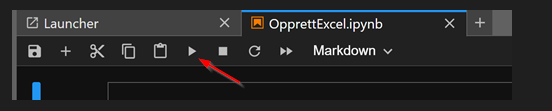
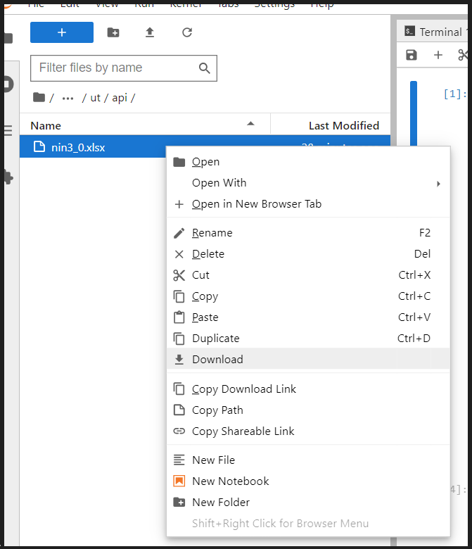

# Opplagsverk
Databasediagram: 2 deler Type og Variabel

[Type-diagrammet](https://viewer.diagrams.net/?tags=%7B%7D&highlight=0000ff&edit=_blank&layers=1&nav=1&title=NiN3.0%20ERDiagram_type#Uhttps%3A%2F%2Fdrive.google.com%2Fuc%3Fid%3D1Hx1bMcy3zW6ZlVHqJHPZwPD8MX5akZtx%26export%3Ddownload)

[Variabel-diagrammet](https://viewer.diagrams.net/?tags=%7B%7D&highlight=0000ff&edit=_blank&layers=1&nav=1&title=NIN3.0%20ERDiagram_Variabel.drawio#Uhttps%3A%2F%2Fdrive.google.com%2Fuc%3Fid%3D1WNfl-vzjXFJBpdCK23OiGLlbc-S2yIhP%26export%3Ddownload)

## Apier

[2.3 API](https://nin-kode-api.artsdatabanken.no/swagger/index.html?urls.primaryName=V2.3)

3.0 APiER :

[Test](https://nin-kode-api.test.artsdatabanken.no/swagger/index.html) 

[Prod](https://nin-kode-api.artsdatabanken.no/swagger/index.html)

## Bruk:
Trykk i ønsket kode-blokk og trykk run-knappen, følg så med på statusmelding under kodeboksen.

### Hente resultatfiler: 
Bruk filutforskeren til høyre og høyreklikk fil som ønskes nedlastet.
